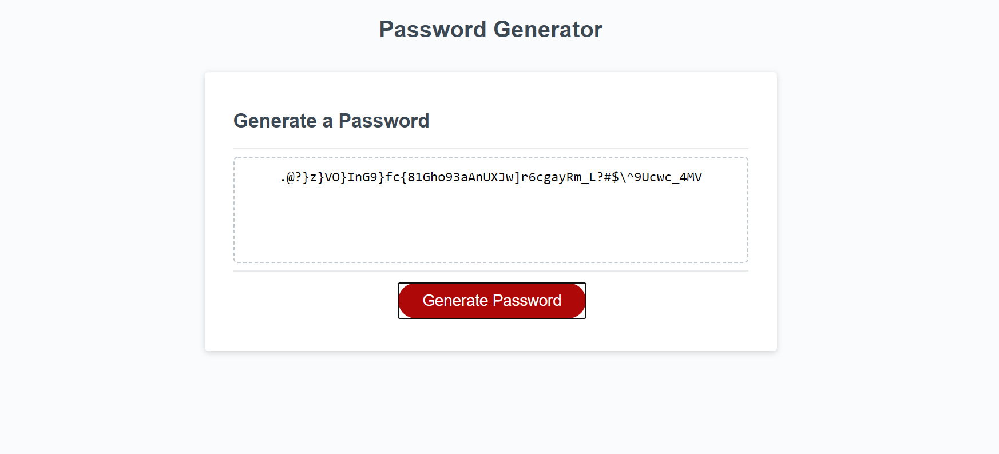

# password-generator

## Write-Up

This homework felt particularly complicated for me. 

I put in a lot of hours, but I'm still a bit shaky when it comes to Javascript. I'm looking forward to working with it more to really get the hang of it. 

I do feel like on a conceptual level I understand Javascript,  but writing it is difficult because my Javascript Google-fu still has a long way to go. Reading Eloquent Javascript is really helping me out and definitely helped me out with some of the issues I came across in this exercise. 

Ultimately, it seemed like I was over complicating some earlier code and using an array really made it much easier to get the logic to work the way it was supposed to. I'm slowly learning how helpful it is to make elements that you can manipulate later with different functions. 

For me, drawing this out and psuedo coding made it clear what I needed to do, but the actual writing is still slow right now. 

At the end of the day I actually managed to finish it, so that's what I'm most proud of at this point. 

## Technologies Used
Javascript  
jQuery  

## Credits
Shoutout to [James Meier](https://github.com/jamesMeier) for his help on this one. It was tough.  

## License Info 
MIT License

Copyright (c) 2021 a-andres1

Permission is hereby granted, free of charge, to any person obtaining a copy
of this software and associated documentation files (the "Software"), to deal
in the Software without restriction, including without limitation the rights
to use, copy, modify, merge, publish, distribute, sublicense, and/or sell
copies of the Software, and to permit persons to whom the Software is
furnished to do so, subject to the following conditions:

The above copyright notice and this permission notice shall be included in all
copies or substantial portions of the Software.

THE SOFTWARE IS PROVIDED "AS IS", WITHOUT WARRANTY OF ANY KIND, EXPRESS OR
IMPLIED, INCLUDING BUT NOT LIMITED TO THE WARRANTIES OF MERCHANTABILITY,
FITNESS FOR A PARTICULAR PURPOSE AND NONINFRINGEMENT. IN NO EVENT SHALL THE
AUTHORS OR COPYRIGHT HOLDERS BE LIABLE FOR ANY CLAIM, DAMAGES OR OTHER
LIABILITY, WHETHER IN AN ACTION OF CONTRACT, TORT OR OTHERWISE, ARISING FROM,
OUT OF OR IN CONNECTION WITH THE SOFTWARE OR THE USE OR OTHER DEALINGS IN THE
SOFTWARE.
[License](LICENSE)

## Links
[Repo](https://github.com/a-andres1/password-generator)
[Site](https://a-andres1.github.io/password-generator/)

## Contact Info
[email me](mailto:alyssaandres1@gmail.com)  
[find me on github](https://github.com/a-andres1)

___
### Notes:

First things first, what is a Readonly id? Readonly means you can't modify the text in any way. So a readonly id makes it impossible for me to copy/paste from the password generator box. I assume that after we have generated the password we should be able to cut/paste things. 

The textarea tag is also new. Seems to be mostly used with forms to set a specific height/width and can contain an infinite amount of characters. 

Added some JS for grabbing upper and lower case letters. Want to write one for numbers next. Numbers, done. Now on to special characters. Not as straightforward as grabbing a charCode this time because they are all over the chart. If I did it the way I'm currently doing it, then it's way too complicated. I'm going to look around for an easier solution. 

Found a solution for my special characters. Made them into a variable as a string, then wrote math to grab a random character from that string.

Got a bunch of loops to figure out next though and that feels a bit intimidating. 

Added my prompts so that I can start track what needs to go with what. I'm still going to need to tell my code "if this prompt returns false, that means no lower case letters" etc. But for now at least I have those. I don't know if they're in the right place. I don't think they are. Also, they are not prompts, but confirms.

## PSUEDO CODING 
For buidling the password.

* Get all the true/falses from the comfirms. 
* Use a for loop to cycle through the character choice code.
* Take those generated charaters and create a string. 
* Print that string to the page.